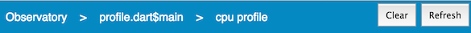
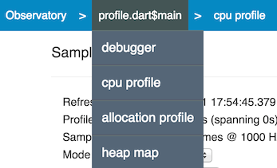
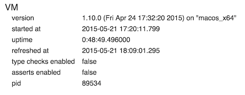
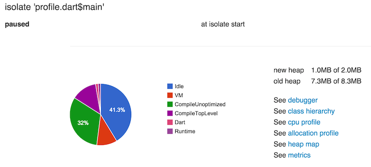

# Getting Started with Observatory

<h4>Contents</h4>
<ol class="toc">
  <li> <a href="#get-observatory">Get Observatory</a> </li>
  <li> <a href="#start-observatory">Start Observatory</a>
  <ol class="toc">
    <li> <a href="#standalone-command-line">Standalone apps from the command line</a> </li>
    <li> <a href="#web-launch">Web apps</a> </li>
  </ol> </li>
  <li> <a href="#observatory-ui">Observatory UI</a> </li>
  <li> <a href="#vm-screen">VM screen</a> </li>
  <li> <a href="#what-next">What next?</a> </li>
</ol>



## Get Observatory {#get-observatory}

Observatory is one of the tools in the Dart SDK. To get it,
you only have to [download](https://www.dartlang.org/downloads/) the SDK.

You can use Dart to create two kinds of applications:
standalone applications (including servers),
and web applications (which run in a browser).
At this time, Observatory can only be used to debug standalone applications.

## Start Observatory {#start-observatory}

How you enable Observatory depends on how you prefer to work.
No matter how you launch Observatory, its UI is exactly the same.

### Standalone apps from the command line {#standalone-command-line}

To enable Observatory from the command line, specify one or more 
Observatory options when launching the dart VM.
See the [dart](https://www.dartlang.org/tools/dart-vm/#observatory)
reference page for a complete list.

For example:

```
$ dart --observe <script>.dart
```

The standalone dart application will print a line like:
```
Observatory listening on http://127.0.0.1:8181/M1K0DBd3DOo=/
```
that includes an authentication code, so as to prevent an unauthorized
process from connecting to the observatory. Copy the URL from your application's
output and open a browser with that URL to see the Observatory UI.

By default, the VM service binds to localhost&mdash;it only accepts
connections coming from the same machine. 
To access a VM running on another machine, you need to forward the
port the VM service is bound to. If the target machine is Linux or Mac
running ssdh, you can forward the port over ssh like so:

```
ssh -L8181:127.0.0.1:8181 user@targetmachine
```

You can also retroactively enable the VM service for a running
process on Linux or Mac by sending the process `SIGQUIT`
(perhaps you have a long-running server that started misbehaving
and you want to investigate why). The process then displays the
port that the VM service is bound to on its stdout.

```
$ ps ax | grep dart
<pid> pts/61   Sl+    0:01 dart example.dart
$ kill -s SIGQUIT <pid>
Observatory listening on http://127.0.0.1:<port>
```

### Web apps {#web-launch}

Currently Observatory does not support debugging web applications. See 
["Debugging Dart Web Apps"](https://webdev.dartlang.org/guides/debugging) for
information on debugging Dart web applications.

## Observatory UI {#observatory-ui}

Observatory uses a browser-based UI&mdash;the UI is the same no
matter how it is launched.

A solid blue bar appears at the top of most screens. The word
**Observatory** is on the left. In some screens,
a **Refresh** button is on the right.
You can resample the information at any time using the Refresh button.
There may also be other buttons on the right that are specific to
a particular screen, such as the **Clear** button in the CPU Profile screen.



A breadcrumb trail, inside the blue bar, shows where you are in the 
Observatory UI.  You can click items in the breadcrumb trail to
navigate to other parts of the UI.

If you hover over the items in the breadcrumb bar, drop-down menus
provide additional functionality for each screens. As shown in the
following screenshot, hovering over the root isolate, `profile.dart$main`
in this example, brings up a menu that includes
_debugger_, _cpu profile_, _allocation profile_, and _heap map_.



You can return to the [VM screen](screens.html#vm-screen) at any time by
clicking **Observatory** in the breadcrumb bar.

The next section describes the VM screen, Observatory's landing page.
For a comprehensive list of all screens,
see [Screens in Observatory](screens.html).

## VM screen {#vm-screen}

When you first connect to Observatory, it opens the VM screen,
which reflects information available at the moment the app was sampled.
For example:



To update the information, click the **Refresh** button in the upper
right corner.

The displayed information includes:

version
: When the VM was built and for which architecture.

started at
: The time stamp when the VM was started.

uptime
: How long the VM has been running.

refreshed at
: When the data was last sampled.

type checks enabled
: True if the VM is checking for type errors.

asserts enabled
: True if assertion statements are evaluated by the VM.

pid
: The process ID.

Below the VM information is a list of isolates.
Every app has an initial isolate named `<file>.dart$main`.



For each isolate, a pie chart shows the breakdown of the activities of the
VM. For more information on the meaning of these activities,
see [User and VM Tags](tags.html).

A list of links take you to various Observatory screens. For more
information, see [Screens in Observatory](screens.html).

Clicking the isolate's name brings up an isolate screen,
with detailed information about that isolate. 
For more information, see [Isolate](isolate.html).

## What next? {#what-next}

Where you should go next depends on what questions you'd like to answer.

Unfamiliar with the terminology?
: [Glossary of VM Terms](glossary.html)

Want to find screens and features in the UI?
: [Screens in Observatory](screens.html)

Want to see where your app is spending its time?
: [CPU Profile](cpu-profile.html)

And dive into "power" profiling?
: [User and VM Tags](tags.html)

Want to set breakpoints?
: [Debugger](debugger.html)

Or collect metrics about your app?
: [Metrics](metrics.html)

Curious about memory allocation?
: [Allocation Profile](allocation-profile.html)<br>

And possible memory fragmentation?
: [Heap Map](heap-map.html)

Want to query (or modify) Dart code?
: [Evaluating Expressions](evaluate.html)

Want to see if your code has executed?
: [Code Coverage](code-coverage.html)

Want a stack trace?
: [Debugger](debugger.html)

Want to know the state of the root isolate or another isolate?
: [Isolate](isolate.html)




